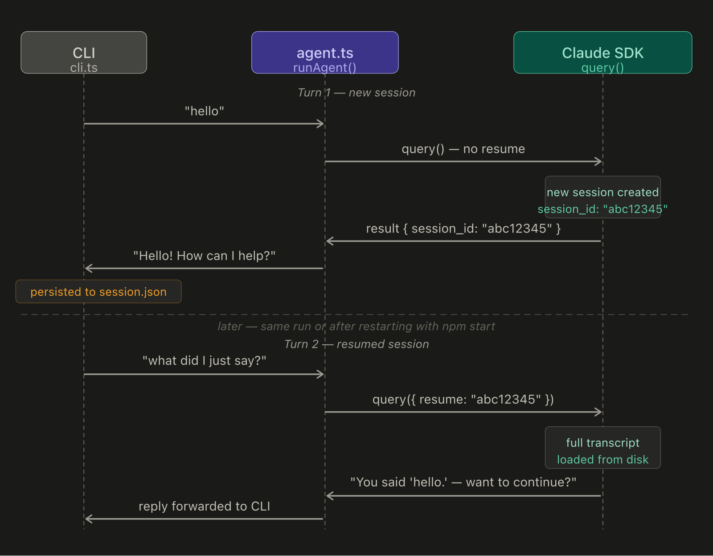

> **Note for publishing on Medium:** reuse the same hero image as Parts 1 and 2 for visual continuity. Upload `./assets/post-03-session-flow.png` to Medium separately and replace the local path below with Medium's image embed.

# Building a Personal AI Agent, Part 3: Sessions

*Part 3 of a series where I build a personal AI agent from scratch in Node.js, one capability at a time. [Part 1](https://medium.com/@bulentg/building-a-personal-ai-agent-part-1-hello-agent-c8f49dc5bba8) covered the basic agent loop. [Part 2](https://medium.com/@bulentg/building-a-personal-ai-agent-part-2-memory-b101e5ce2c9e) added long-term memory with SQLite + FTS5.*

> *This post was written with the assistance of an AI writing program (Claude). The ideas, code, and technical decisions are mine; AI helped structure and clarify the prose.*

---

## The problem we're solving

Here is a conversation with the agent we built in Part 2:

```
you › my favourite colour is orange
agent › Got it! I'll remember that for you.

you › what's my favourite colour?
agent › I don't have any information about your favourite colour stored
        in my memory. Could you tell me what it is?
```

That second reply is embarrassing. The agent has no recollection of what was said *thirty seconds ago in the same conversation*. It only knows what's in its long-term memory store — and it didn't save that preference quickly enough, or searched wrong, or just didn't connect the dots. Either way, it failed a trivially easy test.

The root cause is in `agent.ts`. Every time you press Enter, `cli.ts` calls `runAgent(input)`, which calls `query()` with a fresh prompt and no connection to anything said before. The SDK has no idea those turns are related. Each one is a standalone, isolated request.

Sessions fix this. They give the agent its short-term memory back.

---

## What a session actually is

Sessions are not a complicated concept: a session is a conversation transcript stored on disk, identified by a UUID. When the SDK finishes a turn, it writes the full exchange — user messages, tool calls, tool results, assistant replies — to `~/.claude/projects/`. The next turn can load that transcript and continue from where it left off.

As a developer, you get two things from the SDK:

1. Every result message includes a `session_id` field.
2. The `query()` options accept a `resume` field — pass a `session_id` there and the SDK picks up the conversation.

That's it. Two fields. The heavy lifting (storing the transcript, loading it, threading it into the model's context window) is all handled for you.

What you build is the plumbing: capture the session ID after each turn, persist it somewhere cheap, and hand it back on the next call.

---

## sessions.ts — a ten-line persistence layer

We store the session ID in `data/session.json`. That file is already gitignored (the whole `data/` directory is), and it sits next to `agent.db` from Part 2.

```typescript
// src/sessions.ts
import { readFileSync, writeFileSync, mkdirSync } from "node:fs";
import { dirname } from "node:path";

const SESSION_PATH = process.env.AGENT_SESSION_PATH ?? "data/session.json";

export function loadSessionId(): string | undefined {
  try {
    const { sessionId } = JSON.parse(readFileSync(SESSION_PATH, "utf8"));
    return typeof sessionId === "string" ? sessionId : undefined;
  } catch {
    return undefined;
  }
}

export function persistSessionId(sessionId: string): void {
  mkdirSync(dirname(SESSION_PATH), { recursive: true });
  writeFileSync(
    SESSION_PATH,
    JSON.stringify({ sessionId, savedAt: new Date().toISOString() }, null, 2),
  );
}
```

`loadSessionId` wraps the file read in a try/catch and returns `undefined` on any failure — file not found, corrupted JSON, missing field. The caller gets a clean signal: either there's a session to resume, or there isn't.

`persistSessionId` is a straightforward write. The `savedAt` timestamp is there for debugging, not for the agent.

One thing to be clear about: this file is a *pointer*, not the actual conversation. The full transcript — every message, every tool call, all the context — lives in `~/.claude/projects/`, managed by the SDK. Our `session.json` just remembers which session to resume.

---

## agent.ts — threading the session ID

The change to `agent.ts` is small but the structure is worth explaining.

```typescript
// src/agent.ts (updated)
const BASE_OPTIONS = {
  systemPrompt: SYSTEM_PROMPT,
  mcpServers: { memory: memoryMcpServer },
  allowedTools: ["WebSearch", "WebFetch", ...memoryToolNames],
  permissionMode: "bypassPermissions" as const,
  maxTurns: 10,
};

async function runQuery(
  userMessage: string,
  sessionId?: string,
): Promise<{ reply: string; sessionId: string }> {
  const chunks: string[] = [];
  let outSessionId = "";

  for await (const message of query({
    prompt: userMessage,
    options: { ...BASE_OPTIONS, ...(sessionId ? { resume: sessionId } : {}) },
  })) {
    if (message.type === "result" && message.subtype === "success") {
      chunks.push(message.result);
      outSessionId = message.session_id;
    }
  }

  return { reply: chunks.join("\n").trim(), sessionId: outSessionId };
}

export async function runAgent(
  userMessage: string,
  sessionId?: string,
): Promise<{ reply: string; sessionId: string }> {
  if (sessionId) {
    try {
      return await runQuery(userMessage, sessionId);
    } catch {
      // Stale or deleted session — start fresh.
    }
  }
  return runQuery(userMessage);
}
```

`BASE_OPTIONS` extracts the static config so the two `query()` calls don't duplicate it. The spread `...(sessionId ? { resume: sessionId } : {})` only adds the `resume` field when we actually have an ID to resume.

`runQuery` is the private worker. `runAgent` is the public function that handles the stale session case.

That stale session catch matters. We tested what happens when you pass a fake session ID to `query()` — the SDK process exits with code 1. If you clone this repo six months from now with an old `session.json` pointing at an expired session, you'd get a silent crash without that catch. Now you get a clean fallback to a fresh session. The user loses the old context, but the agent keeps working.

The return type changed from `Promise<string>` to `Promise<{ reply: string; sessionId: string }>`. That's a breaking change for `cli.ts`, which we update next.

---

## cli.ts — wiring it all together

```typescript
// src/cli.ts (updated)
import * as readline from "node:readline/promises";
import { stdin, stdout } from "node:process";
import { runAgent } from "./agent.ts";
import { loadSessionId, persistSessionId } from "./sessions.ts";

const isNewSession = process.argv.includes("--new");
let sessionId = isNewSession ? undefined : loadSessionId();

const rl = readline.createInterface({ input: stdin, output: stdout });

if (sessionId) {
  console.log(`personal-agent — resuming session ${sessionId.slice(0, 8)}…`);
} else {
  console.log("personal-agent — new session");
}
console.log("─────────────────────────────────────");
console.log("(run with --new to start a fresh session)");

while (true) {
  const input = (await rl.question("\nyou › ")).trim();

  if (!input) continue;
  if (input === "exit" || input === "quit") break;

  try {
    const result = await runAgent(input, sessionId);
    sessionId = result.sessionId;
    persistSessionId(sessionId);
    console.log(`\nagent › ${result.reply}`);
  } catch (err) {
    console.error("\nerror:", err instanceof Error ? err.message : err);
  }
}

rl.close();
console.log("\nbye.");
```

Read this top to bottom and the behaviour falls out:

Before the loop starts, check for `--new`. If absent, load whatever session ID was saved last time. The agent prints which mode it's in — "resuming session abc12345…" or "new session" — so you always know what context it has.

Inside the loop, `runAgent` now returns both the reply and the new session ID. We capture both, persist the ID immediately (so it survives even if you Ctrl-C mid-session), and print the reply.

The `--new` flag is the escape hatch for when you genuinely want a blank slate. Running `npm start -- --new` skips the load and starts fresh, overwriting the saved ID on the first turn.

---

## How it all fits together

Here's the session ID threading across a turn boundary — the same applies whether the second turn is in the same process or after a restart:



Turn 1 has no `resume`. The SDK creates a new session and includes `session_id: "abc12345"` in the result. `cli.ts` immediately persists that ID to `data/session.json`.

Turn 2 — whether it's five seconds later or after you've restarted the process — loads `"abc12345"`, passes it as `resume`, and the SDK loads the full transcript from disk. The model has the complete conversation history in its context window.

---

## Sessions and memory are not the same thing

Post 2 gave the agent long-term memory via SQLite. This post gives it short-term context via sessions. They solve different problems and work together.

**Sessions** hold the full transcript: every message, tool call, and result from the current conversation. They're fast (the SDK loads from a local file), complete, and exactly right for conversational follow-up — "what did you mean by that?", "can you expand on the second point?", "hold on, go back to what you said about X". The transcript has all of it.

**Memory** holds distilled, durable facts: things you've told the agent that are worth keeping across many conversations over months. It's what lets the agent greet you correctly next Tuesday without needing to re-read last week's session. It's also selective — the agent decides what's worth saving, rather than keeping everything.

The interesting tension: long-term memory partially covers sessions. If the agent saved every important thing in the conversation, you could reconstruct context by searching memory. But search is lossy — you only find what you think to look for, and tool call details don't get saved, only conclusions. Sessions are lossless for the current conversation. Memory is lossy but durable.

In practice they're complementary: sessions handle "earlier in this conversation", memory handles "something I told you a week ago".

---

## What we deliberately didn't do

**Named sessions.** You could add a `--session=work` flag, maintain separate session files per name, and switch between them. That's genuinely useful for keeping different projects' contexts separate. For now, "latest" is enough — the agent's long-term memory handles cross-context persistence.

**Session listing and inspection.** A `sessions list` command that prints recent session IDs with their first message would be handy. Not needed yet.

**Detecting stale session errors specifically.** Our catch block swallows *all* errors from `runQuery`, not just stale-session failures. If the API is down and `query()` throws, we'd silently start a new session instead of surfacing the real error. For a personal agent this is a fine trade-off — the failure mode is "lost context" rather than "crash" — but it's worth knowing about.

**Session pruning.** Sessions accumulate in `~/.claude/projects/`. Nothing cleans them up automatically. For a personal agent with light usage, this isn't a problem. At scale it would be.

---

## What's next

Post 4: scheduled tasks. The agent will be able to act on its own clock — checking things, sending reminders, running jobs — without you having to ask. We'll use `node-cron` and a `schedule_task` tool, keeping the same architectural pattern: the agent decides when to act, we just give it the tools.

Code for this post is tagged `post-03-sessions` in the [repo](https://github.com/bgorkem/personal-agent).

---

*If you spot something wrong or would do it differently, leave a comment. The series is being written as I build, so feedback shapes what comes next.*
